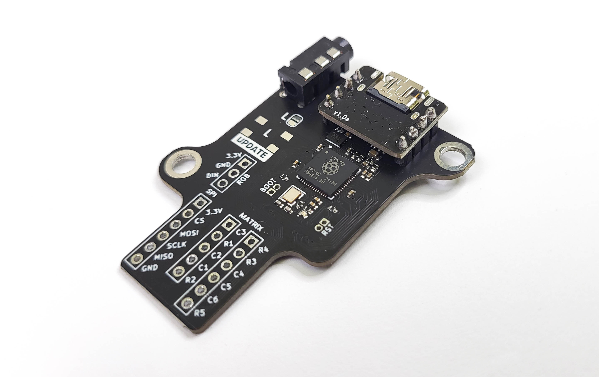

## Splinktegrated

The splinktegrated is a board made for dactyls.

It is based on the [0xB2 Splinky](https://github.com/plut0nium/0xB2) by plut0nium.

Features:

- designed for assembly with off-the-shelf components at JLC
- connectors for up to 5 rows and 6 columns
- connectors for a trackball
- 2 holes for M4 screws
- ESD protection on USB and serial line
- 16MB memory
- footprint for audio jack and reset button
- reversible, with a jumper for power

How to order:

- grab the latest gerber/bom/pos files in the release section
- those are made to be ordered at JLCPCB
- order in standard 1.6mm thickness  

## License

CERN Open Hardware Licence Version 2 - Strongly Reciprocal